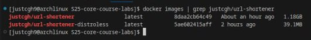

# Docker Best Practices  

This document outlines the best practices followed in the `Dockerfile` and `distroless.Dockerfile` used for building and running the `url-shortener` application.  
`Dockerfile` does not utilize the multi-stage build because I thought that it would be something that I will implement in a distroless image. However, it could be done in the base image as well, which would have diminished its size drastically, but at that point I was already fed up with python experience, and let it be as is.

## **Best Practices in Dockerfile**  

### **1. Using an Official Base Image**  

We use the official Golang base image (`golang:1.23`) as the starting point. Official images are well-maintained, secure, and optimized for performance.  

### **2. Setting a Work Directory**  

```dockerfile
WORKDIR /usr/src/app
```

Setting a working directory ensures all subsequent commands run in the expected location, making the Dockerfile more structured and readable.  

### **3. Creating a Dedicated User for Security**  

```dockerfile
RUN addgroup --system appgroup 
RUN useradd --system appuser --groups appgroup
RUN chown -R appuser:appgroup /usr/src/app
```

Instead of running the container as `root`, a system user (`appuser`) is created. Running applications as non-root minimizes security risks.  

### **4. Using Build Arguments for Configuration**  

```dockerfile
ARG config_path
ENV CONFIG_PATH=$config_path
```

This approach allows passing different configuration paths at build time, adding flexibility to the container setup.  

### **5. Efficient Dependency Management**  

```dockerfile
COPY go.mod .
COPY go.sum .
RUN go mod download
```

Only `go.mod` and `go.sum` are copied first, enabling Docker's build cache to reuse the dependency installation step when only application code changes.  

### **6. Copying Files Selectively**  

```dockerfile
COPY cmd/ ./cmd
COPY internal/ ./internal
COPY templates/ ./templates  
COPY config/ ./config
```

Copying only necessary files reduces the image size and avoids unnecessary files being included.  

### **7. Minimizing Image Size**  

```dockerfile
RUN mkdir bin
RUN go build -o ./bin/url-shortener ./cmd/url-shortener
```

Building only the necessary binary ensures that no unnecessary dependencies or development tools remain in the final image.  

### **8. Exposing Only Required Ports**  

```dockerfile
EXPOSE 8080
```

This makes it clear which port the application listens on without enforcing any binding.  

### **9. Running as a Non-Root User**  

```dockerfile
USER appuser
```

Running applications as a non-root user improves security and prevents privilege escalation attacks.  

### **10. Defining a Clear Entry Point**  

```dockerfile
CMD ["./bin/url-shortener"]
```

The `CMD` instruction ensures the application starts correctly when the container runs.  

## **Comparison: Standard vs. Distroless Images**  

### **Key Benefits of Distroless**  

- **Smaller Image Size:** Only includes necessary runtime dependencies.  
- **Improved Security:** No package manager or shell, reducing attack surface.  
- **Better Performance:** Faster startup due to reduced overhead.

## **Image Size Comparison**


