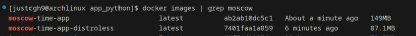

# Docker best practices

In this document I will describe the practices applied to the [Dockerfile](/app_python/Dockerfile). Most of these practices can be found on the [Docker official website](https://docs.docker.com/build/building/best-practices/)

## Choosing the right image

I chose python:3.12.7-alpine, which is a lightweight linux distribution with python pre-installed.

## Creating ephemeral containers

This practice states: "Containers should be stateless and ephemeral, meaning they can be stopped, destroyed, and rebuilt with minimal configuration."

The container itself does not store any specific state, which might have been used in the future builds, leaving all the dependencies on the application code and script, which
are explicitly copied in the dockerfile. Moreover, I use a .dockerignore file to avoid copying undesired files.

## Don't install unnecessary packages

I only install the packages listed in requirements.txt, which remains clean.

## Use a non-root user

In a dockerfile i create an appuser account, and then switch to it to minimize the security risks.

## Dockerfile instructions

When composing the dockerfile I used the instructions for FROM, RUN, CMD, EXPOSE, COPY, USER.

## Distroless Images

I have explored the use of Distroless images, which are designed to contain only the application and its runtime dependencies, without any extra packages that are typically included in traditional base images. Apparently, there are a bunch of compatibility issues, since I have spent a couple hours figuring out the issues with my dockerfile, when problem turned out to be the python image version (I have tried 3.12, 3.9, 3.10 both alpine and slim just to find out that I needed the 3.11-slim)

### Steps Taken

1. **Built the application with a slim Python image** (`python:3.11-slim`).
2. **Installed dependencies** and copied the necessary files into the container.
3. **Used Distroless image** (`gcr.io/distroless/python3-debian12:nonroot`) for the final image to reduce the attack surface and image size.
4. **Ensured the application runs with non-root privileges** using the `nonroot` tag.

### Distroless Image vs. Previous Image

- **Size**: The size of the Distroless-based image is significantly smaller because it does not include unnecessary tools, shells, or package managers.
- **Security**: The Distroless image has a smaller attack surface since it contains only the essential runtime environment, with no shell or package manager available.

